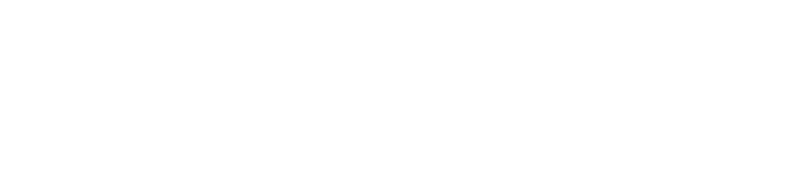

 

# Buzzkill: Honeycomb Hustle Frontend

## Overview
Welcome to the frontend repository for Buzzkill: Honeycomb Hustle, a Next.js-based web application for a strategic NFT staking game. This platform allows users to engage with digital assets in an immersive environment, where they can stake their bee NFTs in various hives and earn honey tokens.

## Features
- **Connect Wallet**: Seamless Web3 wallet integration for transaction handling.
- **Play**: Interactive game interface where users can stake NFTs.
- **Gallery**: Visual showcase of bee NFTs.
- **Mint**: NFT minting portal.
- **Roadmap**: Project's developmental timeline and future plans.
- **Marketplace**: Platform for trading bee NFTs.
- **Docs**: Documentation and guides for users.

## Project Structure
The `src/` directory is organized into subdirectories for assets, components, contexts, hooks, libs, pages, services, styles, theme, and types to ensure a modular and scalable codebase.

### Key Directories
- `assets/`: Static files such as contract ABIs and data sets.
- `Components/`: Reusable UI components like buttons, cards, and modals.
- `contexts/`: React context for global state management.
- `hooks/`: Custom React hooks for shared logic.
- `pages/`: Page components corresponding to routes.

## Getting Started

Click the link below to access the website:

https://buzzkill-frontend-earendel-labs.vercel.app/

Or, to get the frontend running locally:

1. Clone this repository.
2. Install dependencies with `npm install --legacy-peer-deps`.
3. Start the development server with `npm run dev`.

## Building and Running in Production
Build the application for production using `npm run build`, then start it with `npm start`.

